# The Plan Based Shuffler

The shuffler takes two evm stacks: a source and a target and produces a trace consisting of the evm operations required to transform the first into the second. Unlike previous stack shufflers that have been implemented inside of solidity, the plan based approach guarantees termination

It does this by operating in 4 phases:

1. produce a mapping between the source and target stack
2. remove excess from the source stack
3. attempt to realise the mapping
4. if realisation failed: compress the source stack and start again from 1.


Termination is guaranteed by the following facts:
  - we either achieve a valid trace and terminate after step 3 or move to step 4 and compress the source stack
  - the set of items removed from the source stack during the compression phase is strictly
    increasing between iterations, and is bounded by the total number of items in the source stack

## Shuffling

The problem of shuffling from a fixed source stack into a fixed target stack is an instance of the
shortest path problem from graph theory where nodes are instances of an EVM stack, and edges are EVM
opcodes, with weights being either their gas cost or bytecode size (or some combination of the both)
depending on the desired notion of optimality.

While there are algorithms that are both optimal and complete for this problem (e.g. A*), their
complexity (worst case exponential in the branching factor of the graph) makes them unsuitable for
practical use in the compiler.

For this reason various we prefer to use heuristic approaches with empirically demonstrated
performance characteristics on representative solidity programs, and strong termination guarantees.

## The EVM Stack

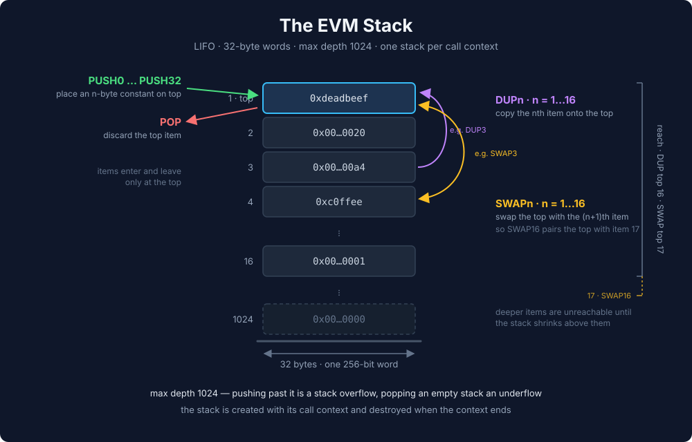

The EVM stack is a list of 32 byte elements. It has a max size of 1024 elements. Since reaching this
limit is in practice only possible for fairly pathological programs, the shuffler currently chooses
to model the stack as infinitely sized for the sake of simplicity.

Shuffling concerns itself with the following stack manipulation operations:

- [`pop`](https://www.evm.codes/?fork=osaka#50): removes the top item from the stack
- [`pushX`](https://www.evm.codes/#60): 32 individual opcodes that each push `X` bytes of data to
    the stack. The data to be pushed is "immediate" (i.e. contained within the program bytecode and
    known statically at compilation time).
- [`dupX`](https://www.evm.codes/?fork=osaka#80): 16 individual opcodes that duplicate the item at
    index `X - 1` (zero indexed) into the top slot.
- [`swapX`](https://www.evm.codes/?fork=osaka#90): 16 individual opcodes that swap the item at index
    `X` (zero indexed) with the item in the top slot.

### `StackData` & `StackSlot`

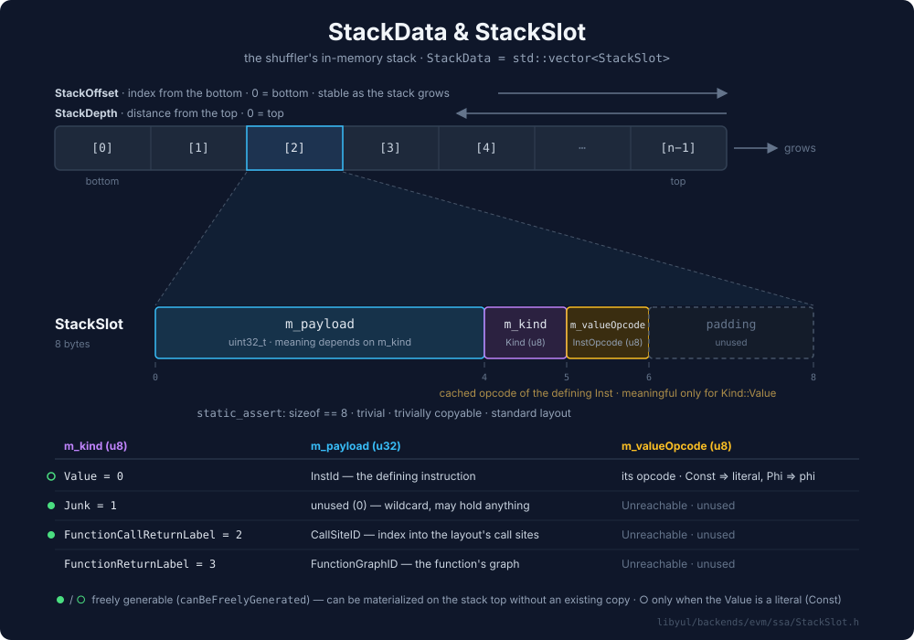

The in-memory representation of the EVM stack used by the shuffler is defined in `SSACFGTypes.h`. It
is an `std::vector` of `StackSlots`s. `StackData` is indexed from the bottom up (i.e. index zero in
the `StackData` vector represents the bottom of the stack. This bottom-up indexing means that
indexes remain stable even as the stack grows, and this property is relied upon throughout the
shuffler.

A `StackSlot` (defined in `StackSlot.h`) is a tagged union with a `uint32` payload. It can have one of the following four kinds:

- `Value`: Either a literal or variable. The payload contains the `InstId` that identifies which
    kind of instruction produced this value, allowing the shuffler to classify the value as either a
    literal or variable.
- `Junk`: A wildcard slot that can contain any value.
- `FunctionCallReturnLabel` / `FunctionReturnLabel`: Represents the location that should be jumped
    to when returning from a function. The payload is an abstract ID representing the concrete byte
    offset that will be inserted during final codegen. The distinction between kinds is needed since the
    codegen phase will perform different asserts depending on if it is in the calling context
    (`FunctionCallReturnLabel`), or callee context (`FunctionReturnLabel`).

### FunctionReturnLabel / FunctionCallReturnLabel

Functions do not exist on the evm level, and are implemented simply as jumps. When we jump into a
function, we must place a value on the stack that represents the location that will be jumped to
when control is returned to the caller. This piece of data is represented as a slot with kind
`FunctionCallReturnLabel` if we are in a calling context, or `FunctionReturnLabel` if we are in a
callee context.

Additional invariants are enforced on slots with kind `FunctionReturnLabel`: they can only be
swapped, but cannot be pushed, duped, or popped. This invariant guards against bugs where we
accidentally return control to a function other than the one that called us.

Since the caller is responsible for introducing and destroying the return location, this invariant
is not enforced on slots with kind `FunctionCallReturnLabel`.

TODO: potential additional invariants?: no duping of `FunctionCallReturnLabel`, at most one
`FunctionCallReturnLabel` present on stack at any one time.

### Wildcard / Junk slots

There are cases where a slot is not required, but removing it immediately would be more expensive
than simply letting it remain on stack and shuffling around it. The main example is while preparing
to revert, where inserting the various pop / swap operations required to remove items from the stack
would be redundant since they will anyway be eliminated by the revert that is now guaranteed to
occur.

For this reason the shuffler carries the notion of a wildcard or junk slot: a slot that should be
retained on stack, but whose value is not important.

Newer code uses the `Wildcard` terminology, but some older code still uses the `Junk` naming. Both
are equivalent.

## Shuffler Phases

### Mapping / Plan Generation

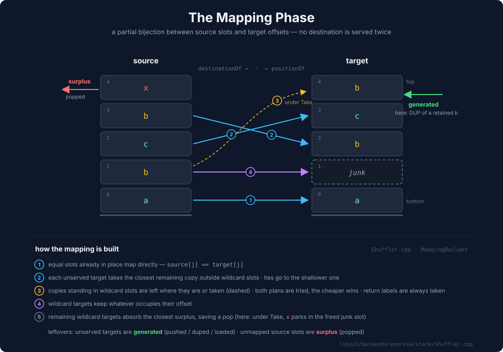

The mapping phase connects matches items in the source with items in the target. This mapping
allows us to determine on a slot by slot basis which actions are required to transform the source
into the target.

The classification assigns slots to one of three categories:

1. A slot in the target has no matching slot in the source: this slot must be generated (via `push`, `mload`, or `dup`)
2. A slot in the source has no matching slot in the target: this slot needs to be removed
3. A slot in the source has a matching slot in the target: this slot needs to be swapped into the correct location

Mapping generation proceeds as follows:

1. iterate over the common suffix of the source / target stacks and connect any slots at the same height with the same content
2. iterate over the target and connect unmapped non wildcard slots to the closest copy in the source that does not share an index with a wildcard target
3. iterate over the target and for each unmapped non wildcard slot, find the closest copy in the source that does share an index with a wildcard target. If the source slot is a `FunctionReturnLabel`, then we map it (we have no choice since we are only allowed to swap these values). For other values mapping is determined by the `WildcardSlotStrategy`, if it is set to `Leave`, then no mapping is performed, if it iset to `Take`, then the source is mapped.
4. iterate over the common suffix and connect and source slots to target slots at the same index if that target slot is wildcard
5. iterate over the target and connect unmapped wildcard slots in the target to the closest unmapped source slot

TODO: impact / intuition around WildcardSlotStrategy.
TODO: properties of the mapping.

### Emission / Plan Execution

Emission operates in three phases, and attempts to produce a valid trace from source to target
following the plan constructed in the mapping phase.

Emission keeps a temporary mutable copy of the source stack that is updated in place as evm
operations are added to the trace.

TODO: temp copy of mapping too?
TODO: need to take care that modifications to the plan in place do not violate termination.

#### Excess Removal

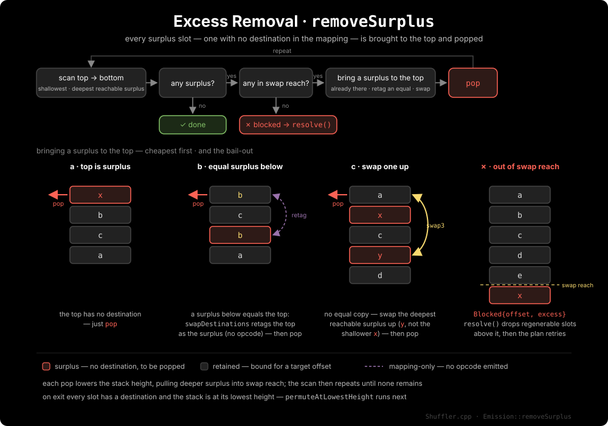

This phase begins execution of the plan by swapping up and popping any slot in the source that does
not have a mapping to a target slot.

This phase will bail and trigger compression if there is a surplus slot that is not reachable via swap.

Once this phase has been completed, the stack is at it's lowest height throughout the entire
emission phase. This is important to note since it also means that it is in it's "most reachable"
state, which puts us in an optimal situation to begin the permutation phase.

It is an invariant at the end of this phase that the mapping is now a total injective function: i.e.
every slot in the source is mapped onto a target slot, and every mapped target slot is mapped by
only one source slot.

#### Permutation

Permutation moves out of place slots in the source into their mapped destination in the target. The
swaps are generated using a result from group theory: cycle decomposition.

Permutation is split into two phases

1. `permuteAtLowestHeight`: special handling for the case post excess removal where the stack is at
   it's lowest height
2. `permute`: a generic permutation based on the cycle decomposition of the source / target.

##### Permutations & Cycle Decomposition

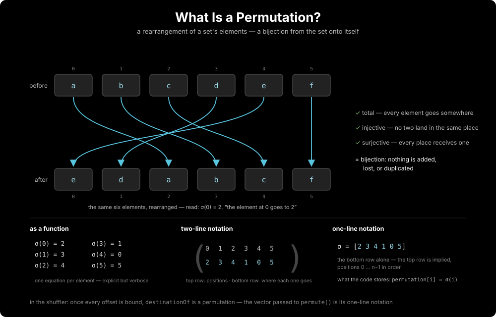

A permutation is a mapping of a sets elements (a bijection from the set onto itself). For a
finite set of n positions you can write a permutation as the function $`σ`$ where $`σ(i)`$ is where element
$`i`$ goes, e.g. on $`{0,1,2}`$: $`σ = (0→2, 1→0, 2→1)`$.

A permutation can be represented as a collection of disjoint cycles.

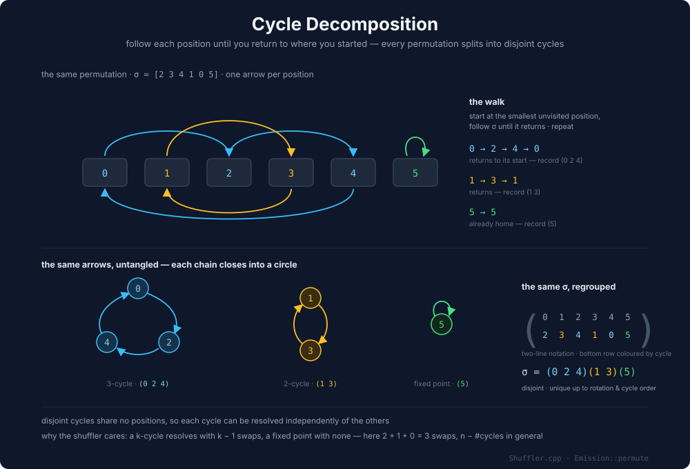

##### permute

`permute` generates a sequence of swaps that transforms a source stack into a suffix of a target
stack (where the size of the suffix is at most the size of the source). The swap trace is generated
based on the cycle decomposition of the permutation between the source and the target. There are two
cases:

1. the top is out of place
  - swap the top with it's target position according to the permutation
2. the top is in place:
  - iterate top down over the current stack and find the first out of position slot
  - swap the top with the misplaced element

We loop on the above until all slots are in place. This loop alone is enough to produce a trace that
moves each slot on the source into it's target slot.

If at any point we try to generate a swap that is out of reach, we bail as `blocked` and jump ahead
to stack compression in preparation for another loop through trace generation.

In addition two optimization phases are implemented for duplicate elements that skip unescessary
swaps for slots that have the same value.

1. Deterministic mapping for duplicate elements (first block of `permute` in `Shuffler.cpp`):
   rewrites the permutation among equal slots so that a slot stays put if an equal slot is destined
   for the offset it's already standing on — it fills that demand itself. Slots that must move are
   currently mapped in ascending order so that the lowest slot in the source is also the lowest
   slot in the target. In future we probably want to change this to a heuristic that minimizes the
   total number of cycles in the permutation.

   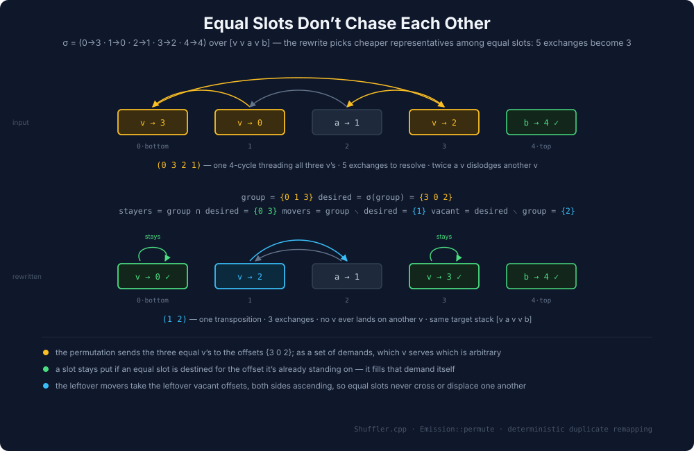

2. Retagging for same value elements in `exchangeWithTop`: the utility function that handles swap
   bookkeeping will skip adding a `swapX` opcode to the trace and instead just direclty update the
   mapping / permutation in place if both the current top and swap target have the same value. TODO:
   is this redundent given the above?

###### Swapping through a cycle containing the top resolves it

If we have a cycle containing the top of the stack, then swapping the top with it's destination
until the top is in place will "resolve" that cycle (i.e. all cycle elements are now at their target
destination).

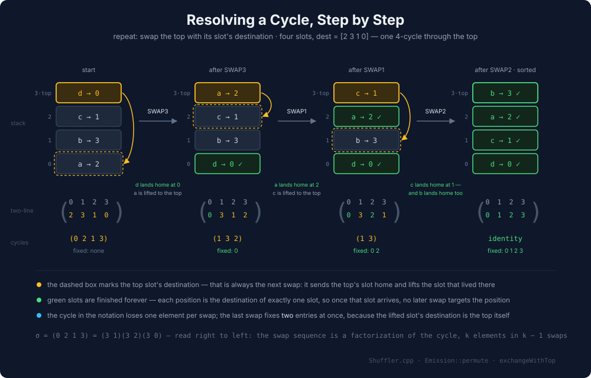

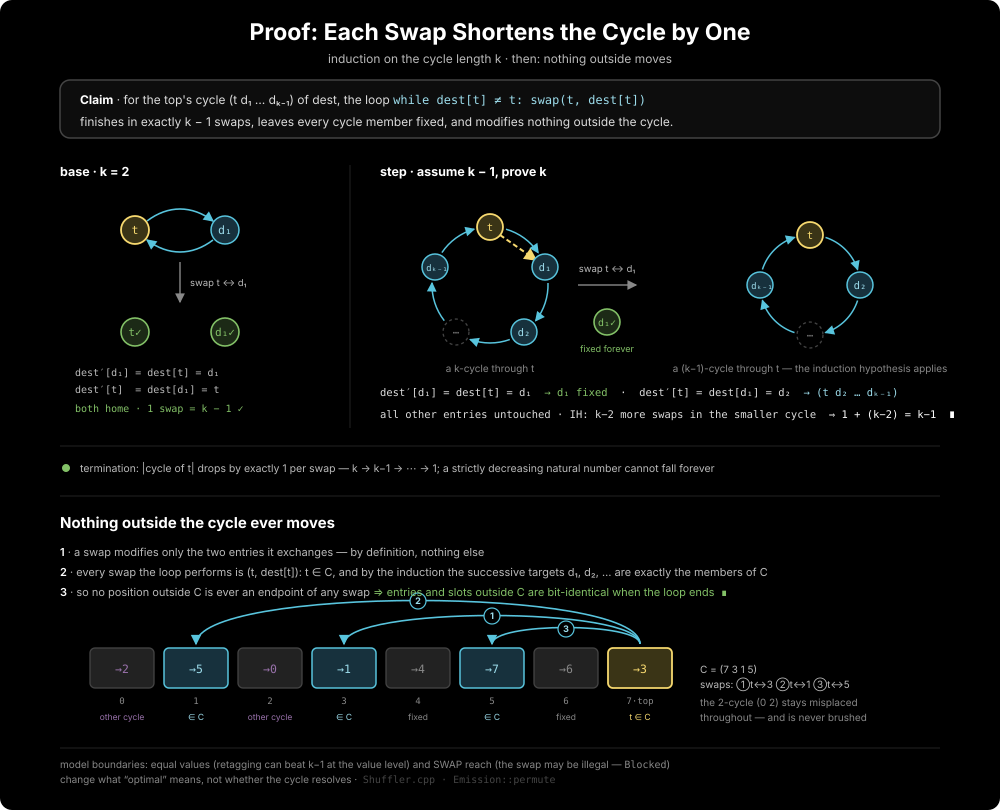

###### Swapping the top into a cycle expands that cycle

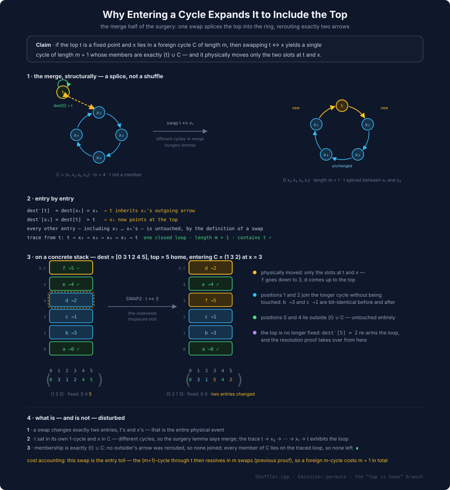

##### `permuteAtLowestHeight`

In addition to the generic `permute` described, above the shuffler also implements a special case
`permuteAtLowestHeight` that is called directly after the excess removal phase. At this point the
source stack is at it's shortest (and thus most reachable) height, so running as many swaps here as
possible will likely result in less memory spilling due to out of reach elements.

since the source stack is potentially shorter than the target at this point, `permuteAtLowestHeight`
first does some bookkeeping to produce a permutation from the current mapping that ensures that the
target of every source slot lands in the bounds of the target suffix.

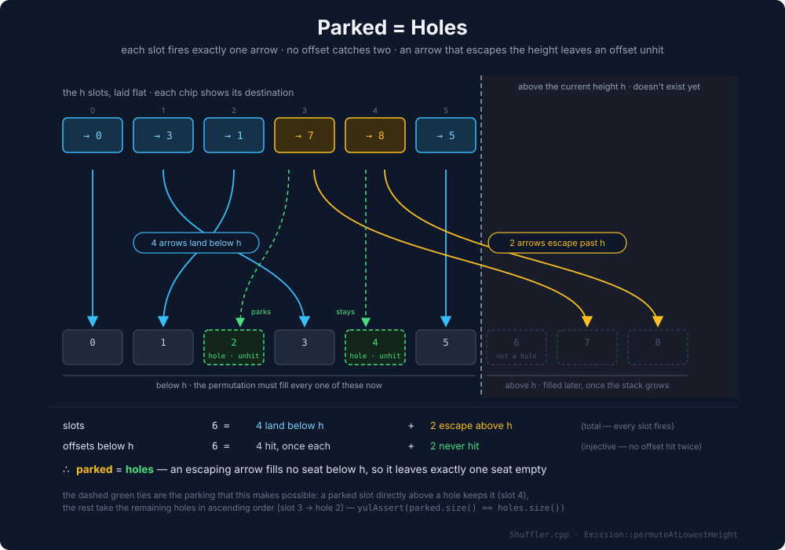

Although the mapping is an injection after excess removal, it may not be possible to place every
slot in it's target yet. This can be the case if the target is *taller* than the source: in this
case a slot with a destination higher than the current height of the stack will not be able to
be moved to it's target using swaps.

For these cases, `permuteAtLowestHeight` instead "parks" these slots in "holes" in the target. A
hole is a slot in the target that does not yet have a source. Since the mapping is now guaranteed to
be an injection, we know that the number of holes must exactly match the number slots that need to
be parked: since we are permuting the source into the suffix of the target with the same size, a
hole can only exist if a source slot is mapped to an index above the currently considered suffix.

#### Bottom Up Generation

This is the final phase of emission. The goal is to produce an element on stack for every target
slot that does not yet have a source bound in the mapping. This is done by working bottom up on the
target and addings `dup`/`push`/`mload` instructions to the trace as needed. calls to `permute` are
interleaved throughout this process, as well as a final call to `permute` once the current stack is
at the same height as the target.

While conceptually simple at a high level, the current implementation is a little more fiddly and
has some extra optimizations and heuristics that avoid emitting unescessary opcodes and attempt to
prioritise duplication of elements that are at risk of going out of reach.

The current count of elements that must still be generated is stored in the `m_pendingGenerations`
member variable that is initialized based on the mapping provided at the start of the emission
phase.

In the following description "produce" refers to inserting one of `dup`, `push`, `mload` as makes
sense for the specific slot into the trace to place the desired value on the top of the stack.
"generate" refers to producing the desired value, and then swapping it into place. These are direct
analogues of the `produce` and `generate` functions in `Shuffler.cpp`.

TODO: generate is a little more subtle than presented here. expand on it's details.

BuildBottomUp operates in a loop from the bottom of the target stack, and modifies the current stack
and trace as it goes. Each loop iteration consists of the following phases:

- skip: if the slot at the current target index is final (i.e. in place according to the mapping),
    then skip to the next iteration
- finish: if m_pendingGenerations == 0 then we are done generating and can proceed to the final
    permute.
- urgency-scan: search for slots that should be duped urgently to avoid going out of reach
- urgent-dup: if an urgent dup is identified during the scan, dup the source and place it eagerly
    before retrying the current iteration
- free-placement: if the target slot at the height of the current working stack does not have a
    mapped source slot, produce it and retry the current offset.
- retained-fetch: if the target slot at the currently considered offset has a mapped source slot,
    bring it bring it up to the top. attempts to leverage value equality to minimize swaps and handle
    unreachable source slots.
- generate-at-idx: if the target slot at the currently considered offset has no mapped source slot,
    generate it.
- place: swap the top down into j.

A more detailed investigation of the non trivial phases continues below

##### urgency-scan

The urgency scan walks up from `j` (the current offset), and looks for the shallowest target offset
that has a mapped source exactly at the max dup depth (i.e. the source would go out of dup reach if
we produce anything more on the current stack).

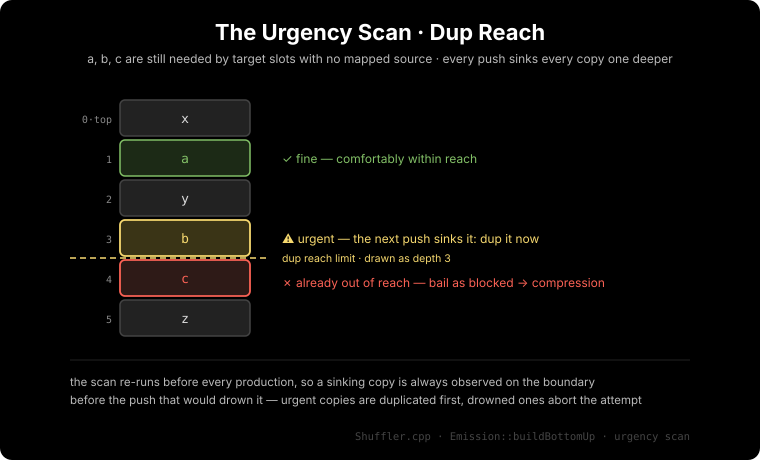

If the scan locates a source copy that is already out of reach, then we bail as blocked immediately
and skip to compression.

There is one exemption here: if the dup source is at index `j` in the source. In this case, it can
be ignored, and we rely on the later retained-fetch or generate-at-idx phase to pull the dup source
to the top. Note that this exemption makes quite some assumptions about the behaviour of the rest of
`BuildBottomUp`.

TODO: expand on assumptions

##### urgent-dup

In this phase, if an urgent dup was identified in the previous phase, we check to ensure that
executing the dup will not move the current target out of swap range, and if that is the case, we
call `generate` to produce the dup.

The same exemption from the previous phase is also applied: if the index of the dup source is the
same as the current target offset we skip this phase (TODO: presumably this check is redundant?).

If the generation fails, we bail with blocked and go to compression.

If the generation does not fail, we start the loop again with the same targetOffset

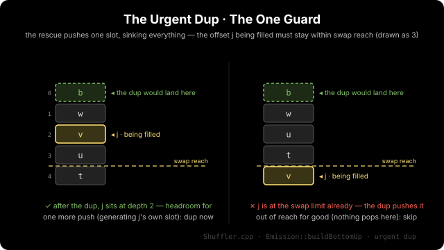

##### free-placement

If the current target offset is the same as the size of the working stack, and the target slot at
the current target offset does not have a bound source in the map (i.e. requires generation) then a
push / dup / mload at this point in the trace will produce the required value exactly at it's target
slot. This is clearly optimal since it avoids the need for any swap.

The same checks around swap depth as in the previous phase apply.

TODO: why do we restart the loop here? didn't we fill this already?

##### retained-fetch

If the value at

##### generate-at-idx

##### Invariant: Every Offset Below TargetOffset is Final

### Compression

